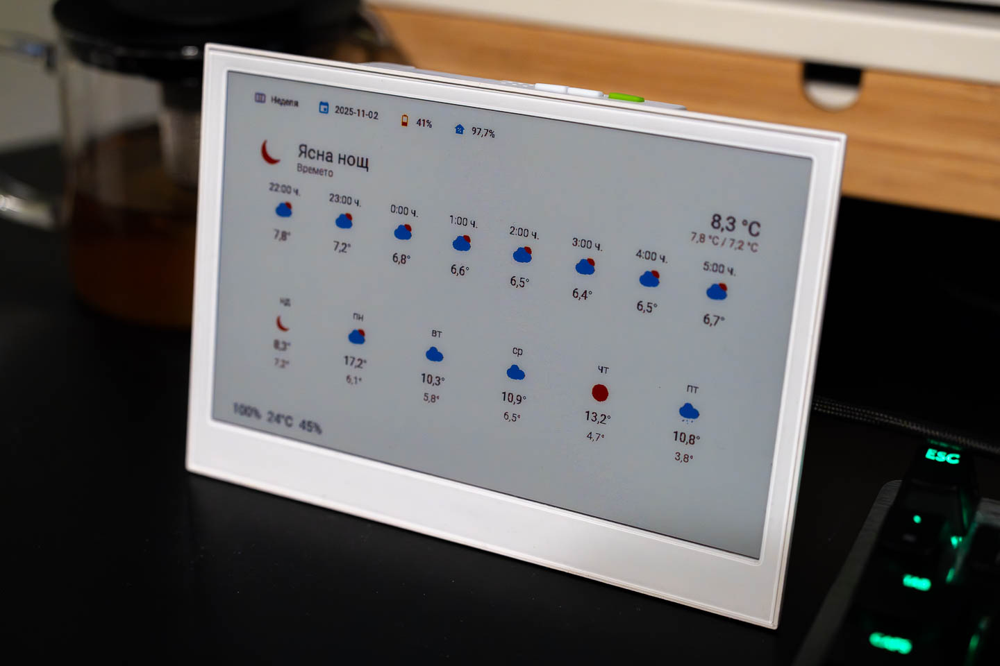

# E-Ink Weather Display for Home Assistant



This project provides a complete guide to creating a beautiful, low-power, high-contrast weather display for your Home Assistant setup using a Seeed Studio reTerminal e1002 E-Ink screen and ESPHome.

## Features

*   **E-Ink Display**: Utilizes an energy-efficient e-paper display that consumes power only when updating.
*   **Weather Forecast**: Displays hourly and daily weather forecasts from Home Assistant.
*   **Low Power**: Designed for deep sleep operation to maximize battery life.
*   **Customizable**: Easily adaptable YAML configuration for both ESPHome and Home Assistant dashboards.
*   **High Contrast Theme**: Includes a custom Home Assistant theme optimized for the limited color gamut of E-Ink displays.

## Hardware Requirements

*   **[Seeed Studio reTerminal e1002](https://www.seeedstudio.com/reTerminal-E1002-p-6533.html)**: The E-Ink display device.
*   **Home Assistant Host**: A device running a supervised version of Home Assistant (like Home Assistant OS on a Raspberry Pi, ODYSSEY, or a VM).
*   **Wi-Fi Network**: A 2.4GHz Wi-Fi network that both your Home Assistant host and the reTerminal e1002 can connect to.

## Prerequisites

*   A running instance of Home Assistant with network access.
*   Your Wi-Fi network SSID (name) and password.

## Setup Instructions

Follow these steps to get your E-Ink weather dashboard up and running.

### Step 1: ESPHome Setup

First, we'll configure and flash the firmware onto the reTerminal e1002 using the ESPHome add-on in Home Assistant.

1.  **Install ESPHome Add-on**:
    *   In Home Assistant, navigate to **Settings > Add-ons > ADD-ON STORE**.
    *   Search for "ESPHome" and install it.
    *   Start the ESPHome add-on.

2.  **Create a New ESPHome Device**:
    *   Open the ESPHome web UI.
    *   Click on **+ NEW DEVICE**.
    *   Give your device a name (e.g., `eink-1`).
    *   When prompted for the device type, select **ESP32-S3**.
    *   ESPHome will generate a basic configuration and show you your device's encryption key and a suggested OTA password. It's a good idea to copy this initial configuration into a text editor so you don't lose these secrets.

3.  **Configure Secrets**:
    *   In the ESPHome dashboard, click the three-dots menu on your new device and select **Edit**.
    *   At the top right, click the three-dots menu and select **Secrets Editor**.
    *   Add your Wi-Fi credentials, the ESPHome API key, and an OTA password. The file should look like this:
        ```yaml
        wifi_ssid: "YourWiFiSSID"
        wifi_password: "YourWiFiPassword"
        eink_api_key: "YOUR_DEVICE_ENCRYPTION_KEY"
        eink_pass: "YOUR_OTA_PASSWORD"
        eink_hotspot: "fallback-password" # A password for the fallback hotspot
        ```
    *   Save the secrets file.

4.  **Add the ESPHome Configuration**:
    *   Go back to editing your device's YAML configuration (`eink-1.yaml` for example).
    *   Delete the boilerplate content and replace it with the entire contents of the `esphome/eink-1.yaml` file from this project.
    *   **IMPORTANT**: In the `substitutions` section at the top of the file, you **must** change the `ha_host_ip` to your Home Assistant's IP address. You can also adjust `sleep_duration_min` or disable deep sleep for initial setup by setting `no_deep_sleep: "true"`.
    *   This section also allows you to set calibration `offsets` for the temperature and humidity sensors, and choose a `wakeup_pin_number` (3, 4, or 5) for the physical buttons.

5.  **Flash the Firmware**:
    *   Click **SAVE**, and then **INSTALL**.
    *   Choose the "Plug into this computer" option.
    *   **Browser Note**: This process uses the Web Serial API, which is supported by Chromium-based browsers like **Google Chrome** or **Microsoft Edge** on Windows, macOS, and Linux. **Firefox is not supported.**
    *   Follow the browser prompts to connect to the reTerminal e1002 and flash the firmware. For more details on this process, see the official [Seeed Studio guide](https://wiki.seeedstudio.com/reterminal_e10xx_with_esphome/#step-3-install-firmware).
    *   After the installation is complete, a "Congratulations" message will appear. Close this dialog.

### Step 2: Home Assistant Integration

Once flashed, the reTerminal needs to be added as an integration in Home Assistant to allow communication.

1.  **Find the Device IP Address**:
    *   In the ESPHome web interface where you just flashed the device, click the **LOGS** button.
    *   The device will output logs as it connects to your Wi-Fi. Look for a line that says `[C][wifi:465]:   IP Address: XXX.XXX.XXX.XXX`. Note this IP address.

2.  **Add the Integration**:
    *   In Home Assistant, navigate to **Settings > Devices & Services**.
    *   Home Assistant should automatically discover the new ESPHome device. Click **CONFIGURE** on the discovered device.
    *   If it's not discovered, click **+ ADD INTEGRATION**, search for "ESPHome", and enter the device's IP address you found in the logs.
    *   You will be prompted to enter the ESPHome API key for the device. This is the `eink_api_key` you saved in your `secrets.yaml` file earlier.

### Step 3: Set up Dashboard Image Service (Puppet)

To display our Home Assistant dashboard on the E-Ink screen, we need an add-on that can take a "screenshot" of it and provide it as an image URL. We'll use the [Puppet add-on](https://github.com/balloob/home-assistant-addons/blob/main/puppet/README.md) for this.

1.  **Add Puppet Repository**:
    *   Go to **Settings > Add-ons > ADD-ON STORE**.
    *   Click the three-dots menu at the top right and select **Repositories**.
    *   Add the following URL: `https://github.com/balloob/home-assistant-addons`

2.  **Install and Configure Puppet**:
    *   Search for and install the "Puppet" add-on.
    *   Before starting it, go to the **Configuration** tab.
    *   **Security Tip**: For better security, create a new, non-administrator user in Home Assistant (**Settings > People > Users > + Add User**) specifically for Puppet.
    *   To get the access token, it is best to log in as this new user. You can do this in a separate browser or an incognito/private tab.
    *   Once logged in as the new user, go to their profile page (bottom left of the sidebar) and create a token under "Long-Lived Access Tokens". Copy this token.
    *   In the Puppet configuration, paste the access token into the `token` field.
    *   Start the Puppet add-on.

3.  **Test Puppet**:
    *   Once the add-on is running, you can test it by navigating to a URL like this in your browser: `http://YOUR_HA_IP:10000/eink-panel/0?viewport=800x480` (replace `YOUR_HA_IP` with your Home Assistant's IP and `eink-panel/0` with the path to your dashboard). You should see an image of your dashboard.
    *   Seeed Studio provides more examples for [capturing different pages](https://wiki.seeedstudio.com/reterminal_e10xx_with_esphome_advanced/#capturing-different-pages).

### Step 4: Install a Custom E-Ink Theme (Recommended)

For the best visual experience on the E-Ink display, we recommend installing the "Graphite E-Ink Light" theme via the Home Assistant Community Store (HACS). This provides better contrast and readability than the default themes.

1.  **Install HACS (if you don't have it)**:
    *   HACS is a custom integration that gives you access to a wide range of community-developed themes, integrations, and plugins.
    *   Follow the official [HACS installation guide](https://hacs.xyz/docs/use) to add it to your Home Assistant instance.

2.  **Add the Graphite Theme**:
    *   Once HACS is installed, go to **HACS > Frontend**.
    *   Click the three-dots menu in the top right and select **Custom repositories**.
    *   Add the URL for the [Graphite theme](https://github.com/TilmanGriesel/graphite) repository: `https://github.com/TilmanGriesel/graphite` and select the **Theme** category.
    *   Click **ADD**. The theme will now be available in HACS. Click on it and then **INSTALL**.

3.  **Enable Theme Loading**:
    *   Ensure your `configuration.yaml` is set up to include custom themes. You'll need access to your Home Assistant configuration files (e.g., using the Studio Code Server add-on).
    *   Open your `configuration.yaml` file and ensure the following lines are present:
        ```yaml
        frontend:
          themes: !include_dir_merge_named themes
        ```
    *   Restart Home Assistant (**Settings > System > RESTART**).

### Step 5: Create the Home Assistant Dashboard

Now, let's create the dashboard view that will be displayed on the screen.

1.  **Create the Dashboard**:
    *   Go to **Settings > Dashboards** and click **+ ADD DASHBOARD**.
    *   Give it a title (e.g., "E-Ink Panel").
    *   Open your new dashboard. Click the three-dots menu at the top right and select **Edit Dashboard**.
    *   Click the three-dots menu again and select **Raw configuration editor**.
    *   Delete the existing content and paste in the content from the `dashboards/weather.yaml` file from this project.
    *   Save the configuration.

2.  **Set Theme for Puppet User**:
    *   Log in as the Puppet user you created earlier.
    *   Go to the user's Profile page.
    *   Under "Theme", select **Graphite E-Ink Light**. This ensures the rendered image uses the correct theme.

### Step 6: Configure Helpers and Weather

1.  **Create Weekday Helper**:
    *   The dashboard uses a helper to display the current day of the week.
    *   Go to **Settings > Devices & Services > Helpers**.
    *   Click **+ CREATE HELPER** and choose **Template**.
    *   Create a **Template a sensor**.
    *   Name it `Weekday`.
    *   For the **State template**, paste the following (this example is in English):
        ```jinja
        
        {{ days[now().weekday()] }}
        ```
    *   Click **CREATE**.

2.  **Add Weather Integration**:
    *   For the weather forecast to work, you need a weather integration. This guide uses the free "Met.no" service, which is great for Europe.
    *   Go to **Settings > Devices & Services > + ADD INTEGRATION**.
    *   Search for and select **Meteorologisk institutt (Met.no)**.
    *   Follow the prompts. Home Assistant will use your instance's location.
    *   **Crucially**, ensure your Home Assistant location is set correctly under **Settings > System > General > Location**.

## Understanding the ESPHome Code

The `eink-1.yaml` script is the heart of this project. Here are some key aspects:

*   **Deep Sleep**: The device sleeps for 15 minutes (`sleep_duration: 15min`) to conserve power and wakes up to refresh the data and screen.
*   **Data Synchronization**: A global variable (`sensors_ready_mask`) and a script (`maybe_render_display`) ensure that the display only refreshes after all data (image, battery, temperature, humidity) has been successfully received. This prevents partial screen updates.
*   **Image Fetching**: The `online_image` component is configured to download the dashboard image from the Puppet add-on URL. This is configured using the `substitutions` at the top of the `eink-1.yaml` file.
*   **Physical Buttons**: You can wake the device from deep sleep by pressing one of the physical buttons. The default is the right green button (`GPIO3`), but this can be changed with the `wakeup_pin_number` substitution.
*   **Custom Logger Port**: The logger is configured to use `UART0`, which is the correct serial port for the reTerminal e1002, allowing you to see debug logs if connected via USB.

## Troubleshooting

*   **No data is displayed on the screen**:
    *   Check the ESPHome logs for your device. Are there errors connecting to Wi-Fi or downloading the image?
    *   Ensure the Puppet add-on is running.
    *   Verify that the ESPHome integration has been added correctly in Home Assistant's **Devices & Services**.
*   **Dashboard image is wrong/default theme**:
    *   Make sure you have set the theme for the dedicated Puppet user in Home Assistant. Log in as the puppet user to verify.

## References and Acknowledgements

This project was inspired by and builds upon the official Seeed Studio documentation for the reTerminal E-Series.
*   **Seeed Studio Wiki**:
    *   [reTerminal e1002 Hardware Overview](https://wiki.seeedstudio.com/getting_started_with_reterminal_e1002/)
    *   [reTerminal E Series with ESPHome](https://wiki.seeedstudio.com/reterminal_e10xx_with_esphome/)
    *   [Advanced ESPHome Usage](https://wiki.seeedstudio.com/reterminal_e10xx_with_esphome_advanced/)
*   **Hardware Schematics**:
    *   [reTerminal e1002 Schematic PDF](https://files.seeedstudio.com/wiki/reterminal_e10xx/res/202004321_reTerminal_E1002_V1.0_SCH_250805.pdf)
